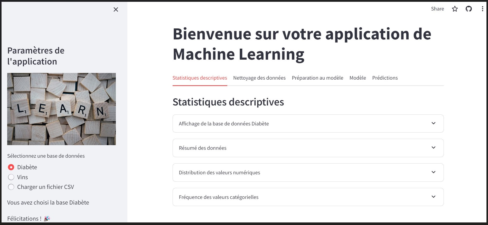

<h1 align="center">Projet Application Machine Learning</h1>

## :point_down: Groupe 1 Diginamic :
3 membres : Amandine André, Andréa Le Marec et Anthony Alves

## :point_down: Prévisualisation de l'application :
<div align= "center">
  

  https://teamwinners.streamlit.app/
</div>

## :point_down: Objectifs :

L'objectif de ce projet est de créer une application de Machine Learning : 
- Proposant 2 jeux de données, ou import d'une BDD au format CSV​
- Puis Traitement de la BDD sélectionnée (data management)​
- Puis choix et entrainement d'un ou plusieurs types de modèles​
- Puis comparaison des performances des différents modèles​
- Puis enregistrement d'un modèle final

## :point_down: Prérequis :
Notre application utilise :
###### Languages
- Python (version 3.11)
###### Librairies additionnelles
- Application web : Streamlit (framework)​
- Analyse de données : Numpy & Pandas​
- Machine Learning : Scikit-learn​
- Rééquilibrage : Imbalanced-learn​
- Visualisation de données : Matplotlib & Seaborn

## 🚀&nbsp; Procédure d'installation de l'application

#### Nouveau projet

Créer un dossier sur votre bureau intitulé **`nouveau_dossier`** .
Ouvrir VSCODE, ou un éditeur de code de votre choix, puis se localiser dans ce dossier.
Ouvrez un terminal et placez-vous dans votre dossier.
```
cd [nouveau_dossier]
```

#### Environnement virtuel
Dans le dossier où vous êtes, créer un environnement virtuel et l'activer grâce à VSCODE, via le "Command Prompt" :
```
virtualenv .venv
.venv\\Scripts\\activate
```

#### Télécharger / cloner tout le dossier 
Veuillez télécharger tout le dossier "projetml" (y compris les dossiers architecture, data, data_management, modeles), à déposer dans votre **`nouveau_dossier`**.

#### Installer les dépendances utiles au projet

Toutes les libraires et frameworks (avec versions) nécessaires au projet sont listées dans le fichier 'requirement.txt'.
Afin de bien faire fonctionner l'application, installez les dépendances nécessaires, toujours sur VSCODE :
```
pip install -r requirements.txt
```

#### Lancement de l'application de machine learning 
Si tout le dossier est bien téléchargé, l'application est utilisable directement, en lancant deux commandes :
- se placer dans le dossier
```
cd [projetml]
```
- lancer l'application streamlit en local
```
streamlit run main.py
```
Vous devriez maintenant arriver sur une page web localhost, où l'application est utilisable. <br>
Sinon, voici le lien de notre application web : https://teamwinners.streamlit.app/ 

## 🚀&nbsp; Etapes à suivre pour utiliser l'application
L'application de machine learning propose plusieurs options avant de lancer un modèle, toutes nécessaires !! Veuillez bien à regarder tous les onglets et sections :

#### 1 - Charger un jeu de données 
Dans le menu de gauche : <br>
👉 2 jeux de données sont proposés par défaut dans l'application : diabète et vin.<br>
👉 Il est aussi possible de charger son propre jeu de données, au format CSV (importez le CSV, indiquez le type de séparateur, et un nom si vous le souhaitez).

#### 2 - Onglet Statistiques descriptives 
Permet de visualiser quelques statistiques descriptives (tableaux et graphiques), afin de vérifier le bon import des données, et avoir un premier aperçu des retraitements qu'il y aura à faire.

#### 3 - Onglet Nettoyage des données 
👉 *Champs sans nom* : Selon les jeux de données, des champs sans nom peuvent s'importer. Une première sous-partie permet de lister les champs sans nom (de type "Unnamed...") et on décide si on supprime ou conserve et renomme le(s) champ(s).<br>

👉 *Valeurs nulles* : là aussi, selon le jeu de données, on peut se retrouver avec des valeurs nulles dans des champs. On affiche d'abord la liste des colonnes contenant des valeurs nulles, et plusieurs choix sont proposés à l'utilisateur : 
- suppresion de toutes les lignes contenant des valeurs nulles (peut être dangereux),
- suppression d'une ou plusieurs colonnes contenant des valeurs nulles
- remplacement des valeurs nulles, selon le type de la colonne (moyenne ou médiane si colonne numérique, valeur la plus fréquente si colonne catégorielle)

#### 4 - Onglet Préparation au modèle
👉 *Détection de la target* : <br>
- Si votre jeu de données possède déjà un champ "target", ce champ sera automatiquement utilisé comme valeur à prédire (target). Si ce n'est pas la variable que vous voulez prédire, veuillez charger un nouveau jeu de données au format csv, où vous aurez au préalable renommé la variable target avec un autre nom.<br>
- Si votre jeu de données ne possède pas de champ "target", vous avez la possibilité d'inscrire le nom de la colonne à prédire dans l'encadré prévu à cet effet.<br>

👉 *Encodage des données* :<br>
- Encodage de la target : si la target sélectionnée est catégorielle, il sera utile de l'encoder en variable numérique afin d'établir un modèle de prédiction (se fera automatiquement dans la section prévue).<br>
- Encodage d'une autre colonne : si votre jeu de données contient des variables catégorielles, que vous souhaitez intégrer au modèle, il sera nécessaire là aussi de les encoder. Il faudra pour cela sélectionner une ou plusieurs colonnes à recoder, et pour chaque colonne à encoder, entrer un nom pour la nouvelle colonne qui sera créée. Sinon, cocher "non".<br>

👉 *Standardisation des données* : Il peut être utile de standardiser son jeu de données, si cela n'est pas déjà fait, pour améliorer la modélisation. Si votre jeu de données n'est pas déjà standardisé, vous avez ici le choix (obligatoire à cocher) de standardiser ou non votre base. <br>

👉 *Corrélations* : des corrélations sont affichées, utiles pour la sélection des features<br>

👉 *Sélection des features pour le modèle* : 3 choix vous sont proposés :<br>
- sélection par défaut des features : toutes les variables numériques du jeu de données (à éviter pour un meilleur modèle)<br>
- sélection manuelle des features : les variables sélectionnées dans l'encadré précédent<br>
- sélection automatique des features : en fonction de leur corrélation (indiquer un seuil)<br>

👉 *Rééquilibrage des données* : Un rééquilibrage des données peut être nécessaire, pour obtenir une meilleure modélisation, dans le cas d'une target catégorielle. Vous avez alors le choix (obligatoire) de rééquilibrer ou non votre jeu de données <br>

👉 *Récapitulatif des données sélectionnées pour le modèle* : pour finir, vous avez une section qui récapitule vos choix précédents : votre target, et vos features.<br>

#### 5 - Onglet Modèle
👉 *Entrainement* : En fonction de la target choisie, des modèles vous sont proposés :<br>
- si target numérique --> modèles de regression : LinearRegression, Ridge, Lasso<br>
- si target catégorielle --> modèles de classification : LogisticRegression, DecisionTreeClassifier, RandomForestClassifier, SVC, KNeighborsClassifier<br>

A chaque fois, vous pourrez choisir des paramètres si cela est demandé. <br>

👉 *Validation / sauvegarde* : un GridSearchCV est effectué pour vous afficher le meilleur modèle de prédiction possible avec vos données (target et features), et vous avez la possibilité ensuite de sauvegarder ou non un modèle <br>

#### 6 - Onglet Prédictions
🚧 Ce module est en cours de développement. Il sera proposé prochainement🚧
